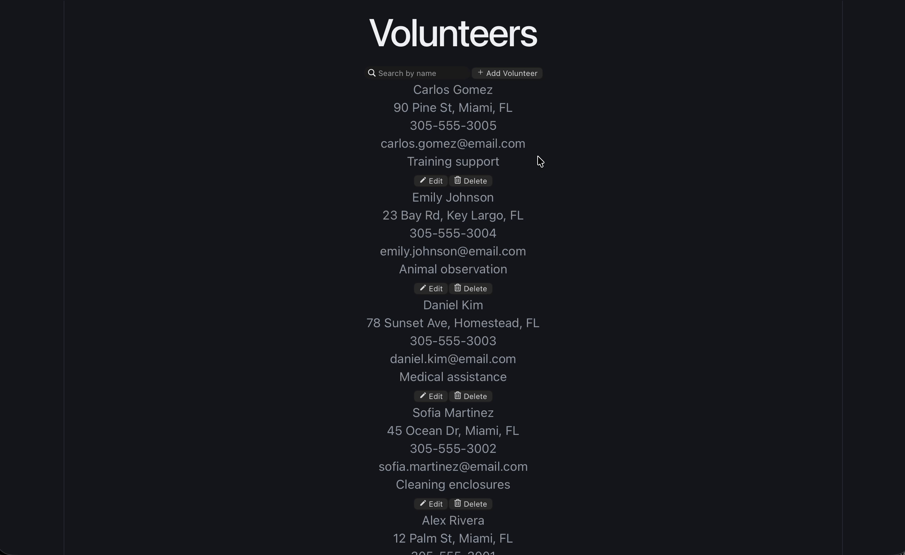
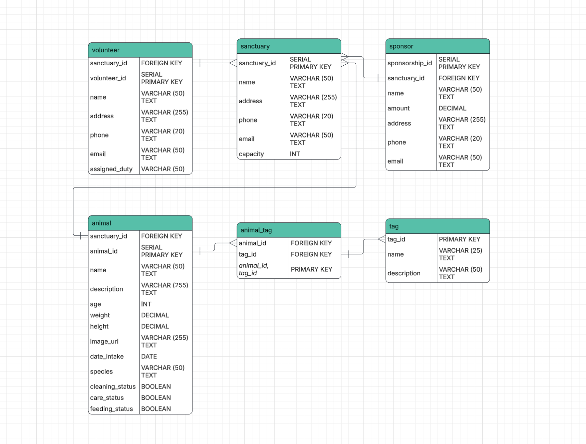
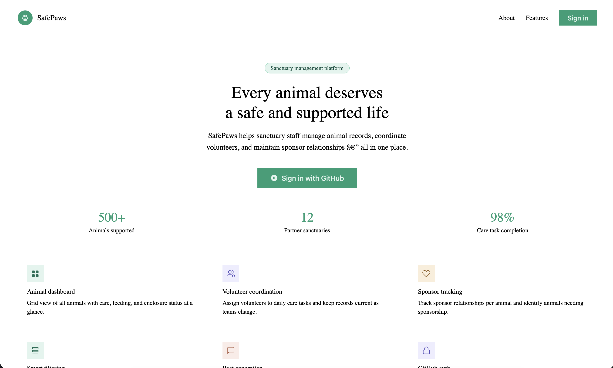
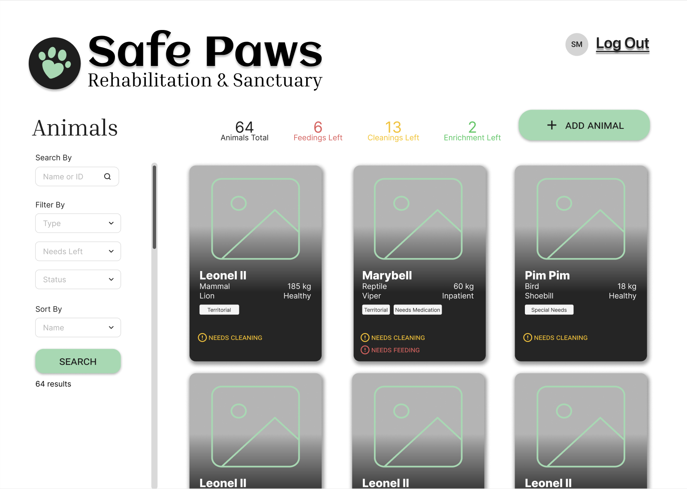
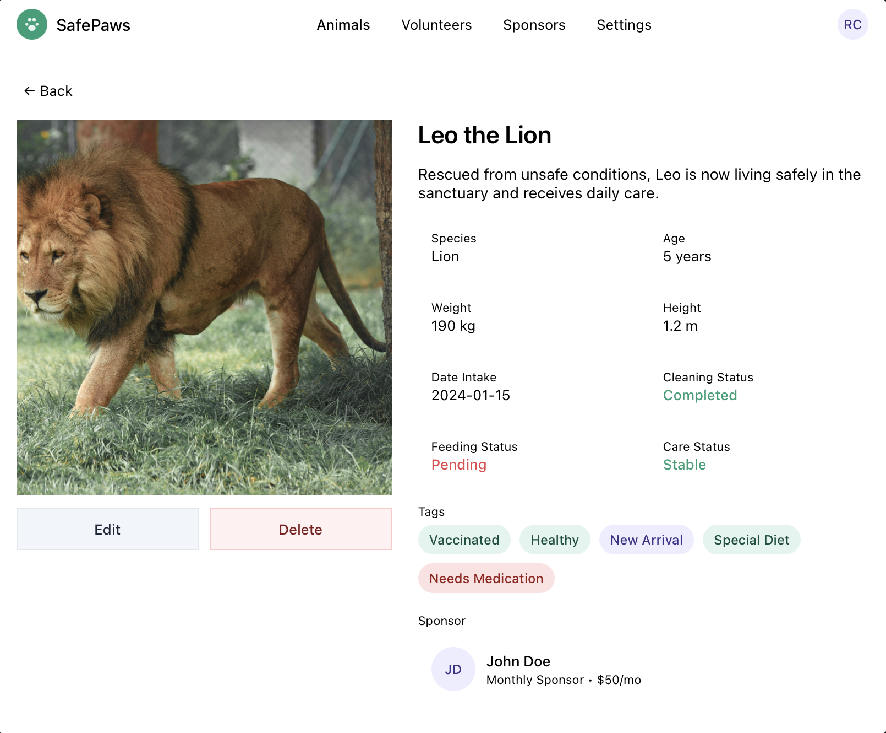
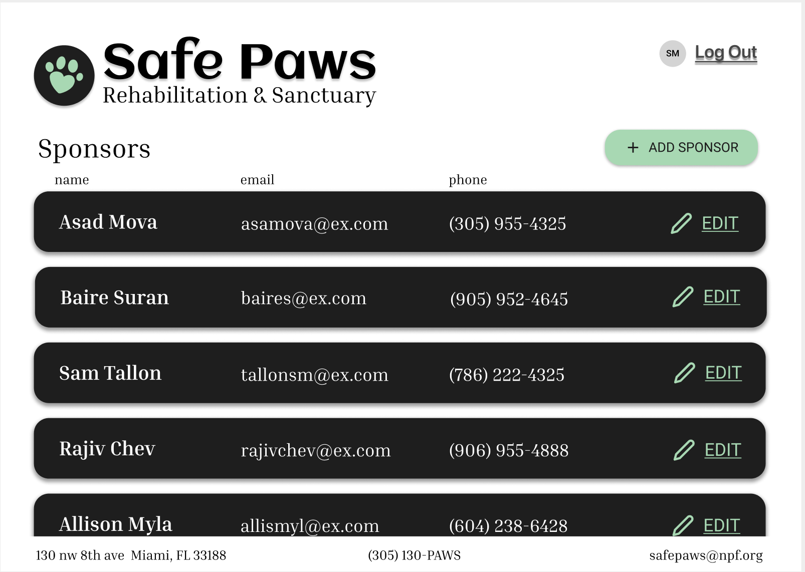
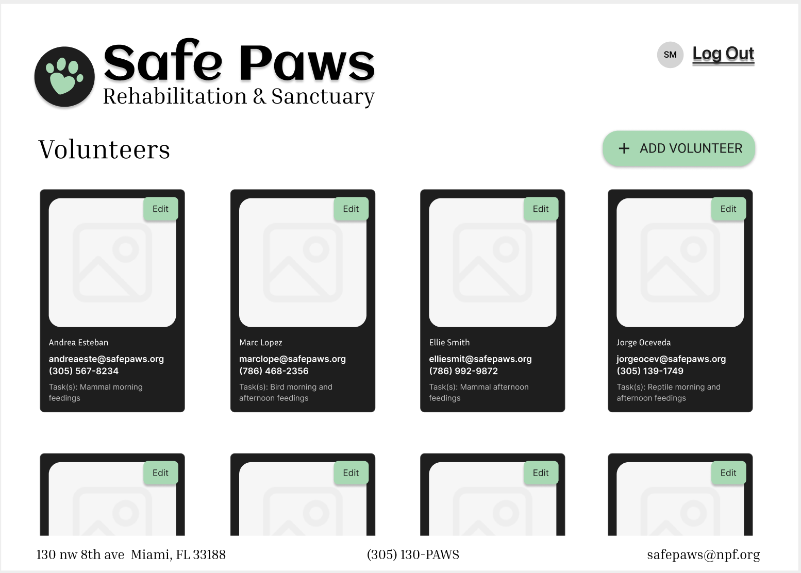
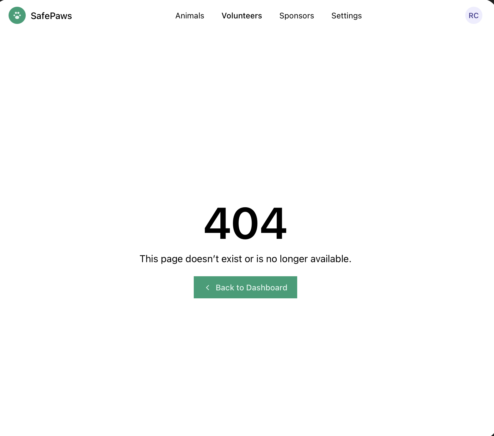

# SafePaws

CodePath WEB103 Final Project

Designed and developed by: Rajiv Chevannes, Samantha Milo, Asad Chaudhry, Baire Diaz

RENDER DEPLOY: https://client-wc16.onrender.com/animals

## About

### Description and Purpose

SafePaws is a web application that allows animal sanctuary staff members to manage animals, sponsor relationships, and volunteer outreach. It also provides strong record management for animals that are rescued from neglect, abuse, or dangerous situations, ensuring they live out their lives in a safe, non-exploitative environment. This application will improve management for an animal sanctuary at a large scale, helping organizations with every animal's needs.

### Inspiration

All animals deserve a good environment and should not have to go through abuse, dangerous situations, injuries, or neglect. Any organization that dedicates an ample amount of time to serving incredible wildlife deserves our help. We are aiming to simplify day-to-day operations for sanctuary admins.

## Tech Stack

- **Frontend:**
  - **Languages:** JavaScript
  - **Frameworks:** React.js (Vite)
  - **Styling:** CSS
  - **Icons:** React Icons
  - **UI Libraries:** react-hot-toast & react-loading-skeleton
- **Backend:**
  - **Languages:** Node.js
  - **Frameworks:** Express
- **Database:** PostgreSQL (Neon)
- **Deployment:** Render
- **Tools:** Git, Postman, Figma

## Features

### ✅ CRUD Workflow
  Use modal-based CRUD forms to streamline workflows and reduce unnecessary page navigation for staff.

  Final:
  

  Prototype:
  

### ✅ Sorting Pet Attributes 
  Implement sorting by name, age, or intake date so staff can quickly find and manage animals more efficiently.
  
  

### ✅ Filtering Animal Status
  Provide filtering by care status, feeding status, enclosure cleanliness, and tags to make it easier for staff to organize and monitor animals.

  

### ✅ Error Handling
  Handle errors gracefully to maintain a smooth user experience and strong data integrity.

  

### ✅ Toast Notifications
  Add toast notifications to provide feedback when animals, sponsors, or volunteers are successfully or unsuccessfully added, updated, or deleted in the system.

  Final:
  

  Prototype:
  

### ✅ Loading Skeletons
  

## Entity Relationship Diagram



### Relationships

sanctuary → animal (1:N)  
sanctuary → volunteer (1:N)  
sanctuary → sponsor (1:N)  
animal ↔ tag (M:N)

## Wireframes








## Installation Instructions

### 1. Clone Repository

```bash
git clone https://github.com/asad-ac/SafePaws.git
cd SafePaws
```

### 2. Create `.env` file in `server` folder

Environment Variables (Neon Database)

This project uses a PostgreSQL database hosted on Neon.

```bash
cd server
touch .env
```

Look at server/.env.example for guidance.

### 3. Install Dependencies

Server:

```bash
cd server
npm install
```

Client:

```bash
cd ..
cd client
npm install
```

### 4. Run Application

Server:

```bash
cd server
npm start
```

Client:

```bash
cd ..
cd client
npm run dev
```

Enjoy!
