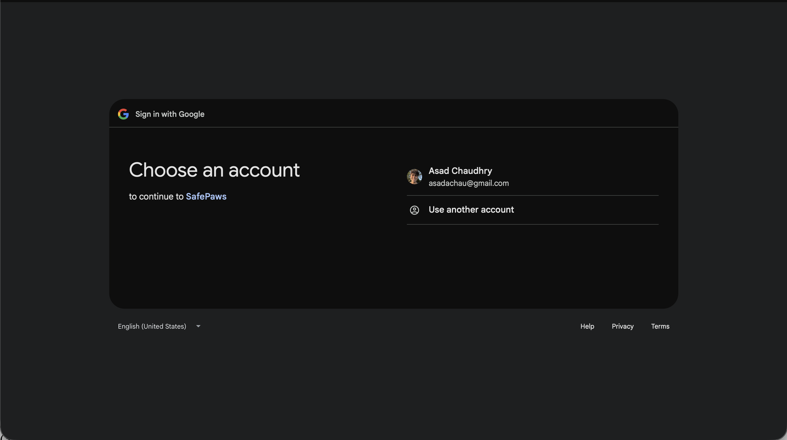
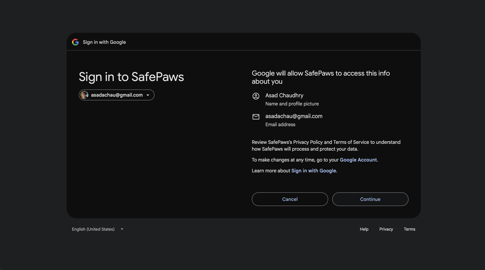
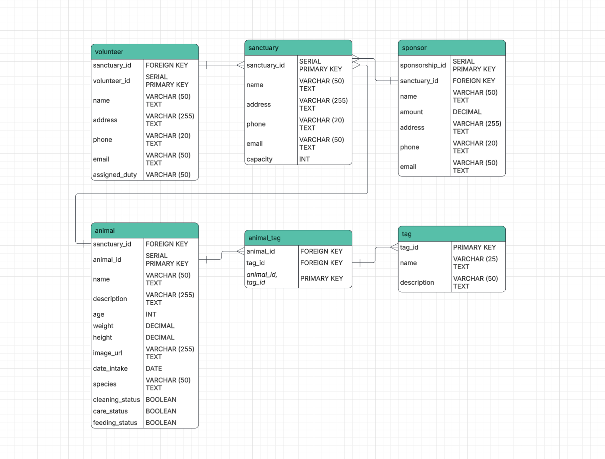
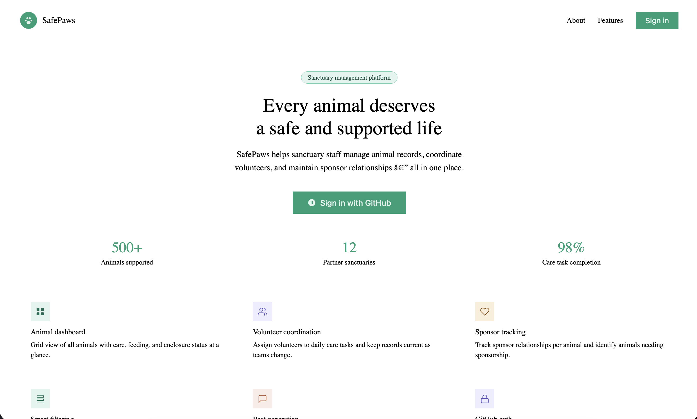
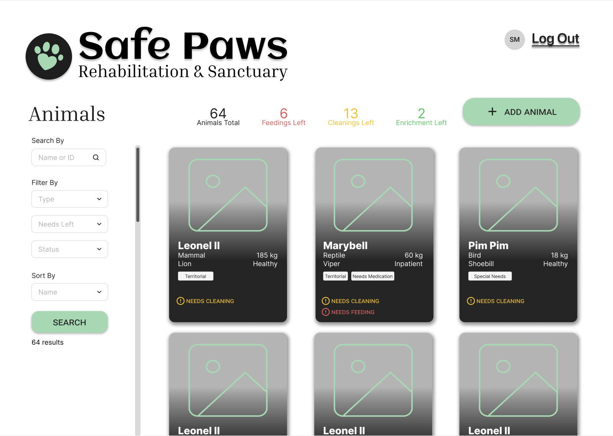
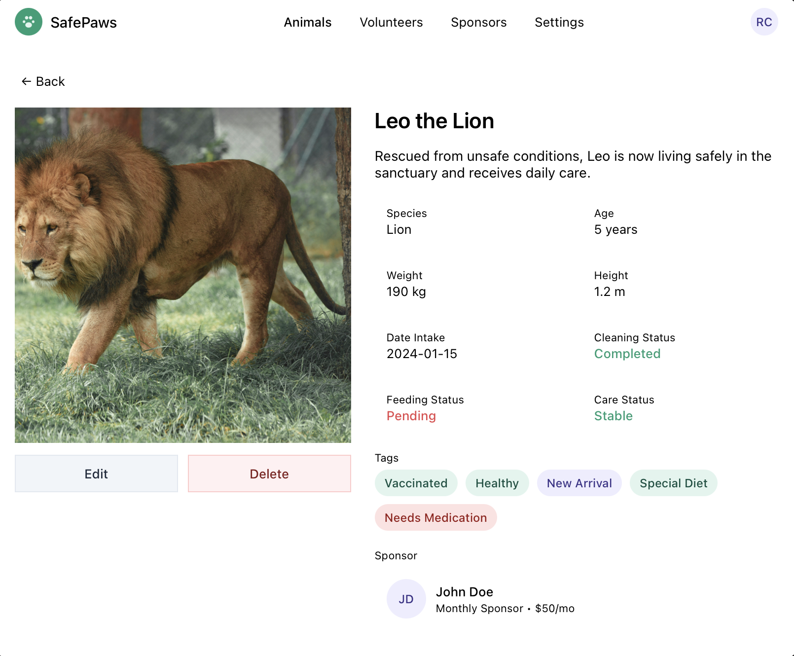
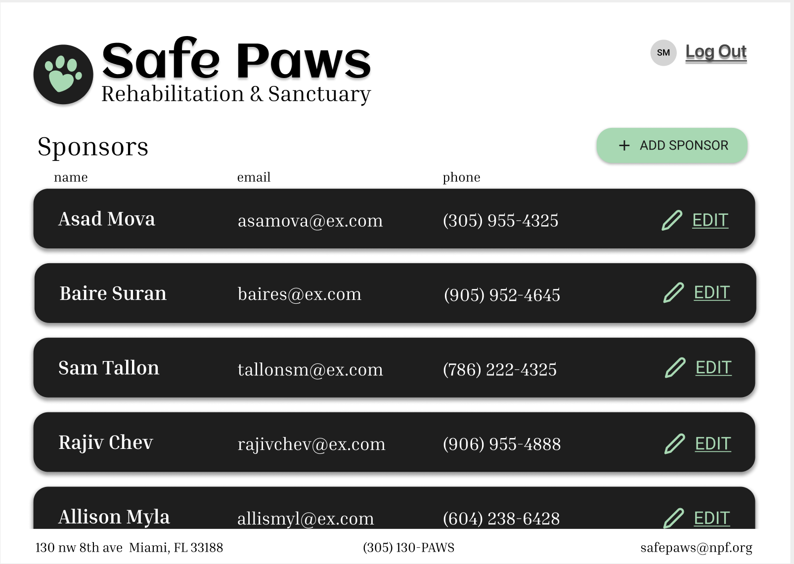
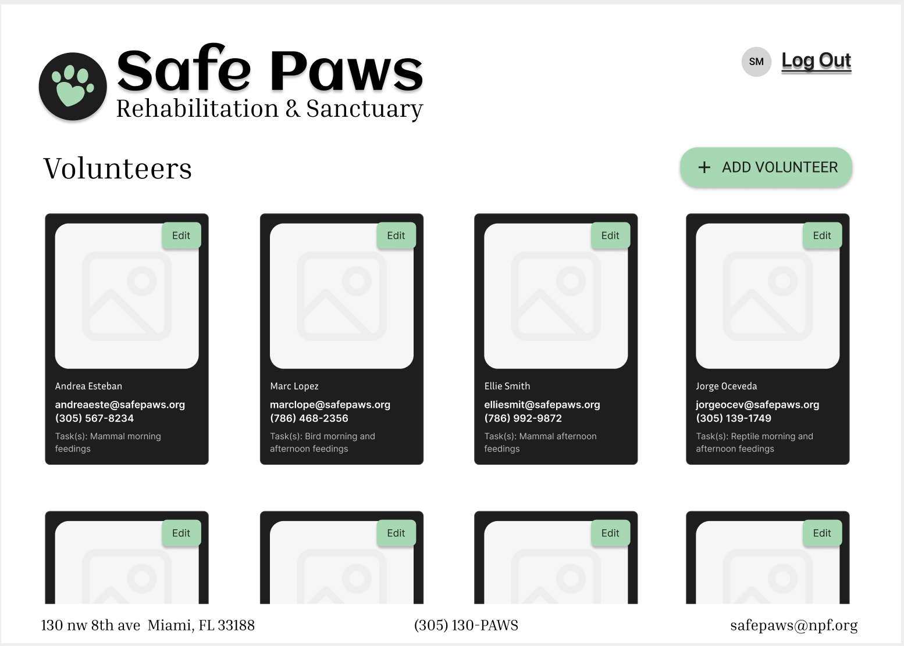
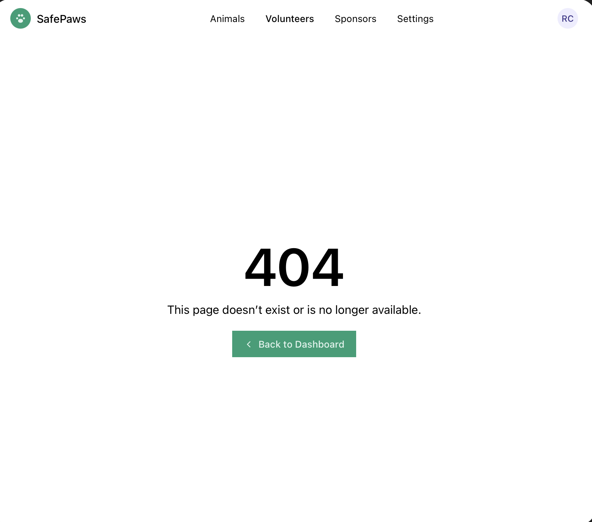

#  SafePaws

CodePath WEB103 Final Project

Designed and developed by: Rajiv Chevannes, Samantha Milo, Asad Chaudhry, Baire Diaz

## About

### Description and Purpose

SafePaws is a web application that allows animal sanctuary staff members to manage animals, sponsor relationships, and volunteer outreach. It also provides strong record management for animals that are rescued from neglect, abuse, or dangerous situations, ensuring they live out their lives in a safe, non-exploitative environment. This application will improve management for an animal sanctuary at a large scale, helping organizations with every animal's needs.

### Inspiration

All animals deserve a good environment and should not have to go through abuse, dangerous situations, injuries, or neglect. Any organization that dedicates an ample amount of time to serving incredible wildlife deserves our help. We are aiming to simplify day-to-day operations for sanctuary admins.

## Tech Stack

- **Frontend:**
  - **Languages:** JavaScript
  - **Frameworks:** React.js (Vite)
  - **Styling:** CSS
  - **Icons:** React Icons
  - **UI Libraries:** react-hot-toast & react-loading-skeleton
- **Backend:**
  - **Languages:** Node.js
  - **Frameworks:** Express
- **Database:** PostgreSQL (Neon)
- **Deployment:** Render
- **Tools:** Git, Postman, Figma

## Features

### ✅ CRUD Workflow
  Use modal-based CRUD forms to streamline workflows and reduce unnecessary page navigation for staff.

  

### ✅ Continue with GitHub or Google
  Sanctuary administrators can login to see management records of animals, sponsors, volunteers, and sanctuary information.

  
  
  

### ✅ Sorting by Pet Attributes & Searching by Name
  Implement sorting by name, age, or intake date and searching so staff can quickly find and manage animals more efficiently.
  
  

### ✅ Filtering by Animal Status & Tags
  Provide filtering by care status, feeding status, enclosure cleanliness, and tags to make it easier for staff to organize and monitor animals.

  

### ✅ Error Handling
  Handle errors gracefully to maintain a smooth user experience and strong data integrity.

  

### ✅ Toast Notifications
  Add toast notifications to provide feedback when animals, sponsors, or volunteers are successfully or unsuccessfully added, updated, or deleted in the system.

  

### ✅ Loading Skeletons

  

## Entity Relationship Diagram



### Relationships

sanctuary → animal (One-to-Many)  
sanctuary → volunteer (One-to-Many)  
sanctuary → sponsor (One-to-Many)  
animal ↔ tag (Many-to-Many)

### sanctuary

| Column       | Type         | Description                  |
| ------------ | ------------ | ---------------------------- |
| sanctuary_id | SERIAL       | PRIMARY KEY                  |
| name         | VARCHAR(50)  | Name of sanctuary            |
| address      | VARCHAR(255) | Address of sanctuary         |
| phone        | VARCHAR(20)  | Phone of sanctuary           |
| email        | VARCHAR(50)  | Email of sanctuary           |
| capacity     | INT          | Animal capacity of sanctuary |

### volunteer

| Column        | Type         | Description                |
| ------------- | ------------ | -------------------------- |
| volunteer_id  | SERIAL       | PRIMARY KEY                |
| sanctuary_id  | INT          | FOREIGN KEY                |
| name          | VARCHAR(50)  | Name of volunteer          |
| address       | VARCHAR(255) | Address of volunteer       |
| phone         | VARCHAR(20)  | Phone of volunteer         |
| email         | VARCHAR(50)  | Email of volunteer         |
| assigned_duty | VARCHAR(50)  | Assigned duty of volunteer |

### sponsor

| Column         | Type         | Description              |
| -------------- | ------------ | ------------------------ |
| sponsorship_id | SERIAL       | PRIMARY KEY              |
| sanctuary_id   | INT          | FOREIGN KEY              |
| name           | VARCHAR(50)  | Name of sponsor          |
| amount         | DECIMAL      | Amount pledged to sanctuary |
| address        | VARCHAR(255) | Address of sponsor       |
| phone          | VARCHAR(20)  | Phone of sponsor         |
| email          | VARCHAR(50)  | Email of sponsor         |


### animal

| Column          | Type         | Description                |
| --------------- | ------------ | -------------------------- |
| animal_id       | SERIAL       | PRIMARY KEY                |
| sanctuary_id    | INT          | FOREIGN KEY                |
| name            | VARCHAR(50)  | Name of animal             |
| description     | VARCHAR(255) | Description of animal      |
| age             | INT          | Age of animal              |
| weight          | DECIMAL      | Weight of animal           |
| height          | DECIMAL      | Height of animal           |
| image_url       | VARCHAR(255) | Image link of animal       |
| date_intake     | DATE         | Joining sanctuary date     |
| species         | VARCHAR(50)  | Species of animal          |
| cleaning_status | BOOLEAN      | Completed or not completed |
| care_status     | BOOLEAN      | Stable or not stable       |
| feeding_status  | BOOLEAN      | Fed or not fed             |

### animal_tag (Join Table)

| Column              | Type | Description |
| ------------------- | ---- | ----------- |
| animal_id           | INT  | FOREIGN KEY |
| tag_id              | INT  | FOREIGN KEY |
| (animal_id, tag_id) | —    | PRIMARY KEY |

### tag

| Column      | Type        | Description        |
| ----------- | ----------- | ------------------ |
| tag_id      | INT         | PRIMARY KEY        |
| name        | VARCHAR(25) | Name of tag        |
| description | VARCHAR(50) | Description of tag |

## Wireframes

### Home Page


### Animals Page


### Animal Detail Page


### Sponsors Page


### Volunteers Page


### 404 Page


## Installation Instructions

### 1. Clone Repository

```bash
git clone https://github.com/asad-ac/SafePaws.git
cd SafePaws
```

### 2. Create `.env` file in `server` folder

Environment Variables (Neon Database)

This project uses a PostgreSQL database hosted on Neon.

```bash
cd server
touch .env
```

Look at server/.env.example for guidance.

### 3. Install Dependencies

Server:

```bash
cd server
npm install
```

Client:

```bash
cd ..
cd client
npm install
```

### 4. Run Application

Server:

```bash
cd server
npm start
```

Client:

```bash
cd ..
cd client
npm run dev
```

Enjoy!
