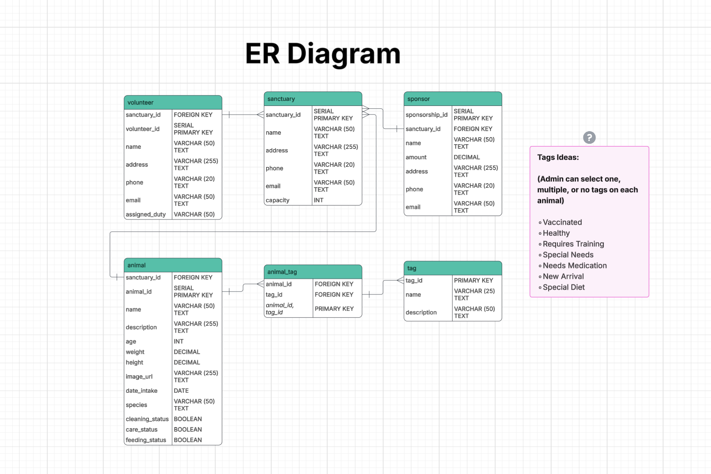

# Entity Relationship Diagram

Reference the Creating an Entity Relationship Diagram final project guide in the course portal for more information about how to complete this deliverable.

## Create the List of Tables

* sanctuary Table
* volunteer Table
* sponsor Table
* animal Table
* animal_tag (JOIN Table)
* tag Table

## Add the Entity Relationship Diagram

| Column Name | Type | Description |
|-------------|------|-------------|
| id | integer | primary key |
| name | text | name of the shoe model |
| ... | ... | ... |

### sanctuary

| Column        | Type         | Description        |
|---------------|-------------|--------------------|
| sanctuary_id  | SERIAL      | PRIMARY KEY        |
| name          | VARCHAR(50) | name of sanctuary                   |
| address       | VARCHAR(255)| address of sanctuary                 |
| phone         | VARCHAR(20) | phone of sanctuary                 |
| email         | VARCHAR(50) | email of sanctuary                  |
| capacity      | INT         | animal capacity of sanctuary                 |

### animal

| Column          | Type          | Description        |
|-----------------|--------------|--------------------|
| animal_id       | SERIAL       | PRIMARY KEY        |
| sanctuary_id    | INT          | FOREIGN KEY        |
| name            | VARCHAR(50)  | name of animal                 |
| description     | VARCHAR(255) | description of animal                  |
| age             | INT          | age of animal                   |
| weight          | DECIMAL      | weight of animal                 |
| height          | DECIMAL      | height of animal                 |
| image_url       | VARCHAR(255) | image link of animal                   |
| date_intake     | DATE         | joining sanctuary date                   |
| species         | VARCHAR(50)  | species of animal                   |
| cleaning_status | BOOLEAN      | completed or not completed                  |
| care_status     | BOOLEAN      | stable or not stable                 |
| feeding_status  | BOOLEAN      | fed or not fed                |

### tag

| Column     | Type         | Description |
|------------|-------------|-------------|
| tag_id     | INT         | PRIMARY KEY |
| name       | VARCHAR(25) | name of tag            |
| description| VARCHAR(50) | description of tag           |

### animal_tag (Join Table)

| Column    | Type | Description                |
|-----------|------|----------------------------|
| animal_id | INT  | FOREIGN KEY                |
| tag_id    | INT  | FOREIGN KEY                |
| animal_id, tag_id|       | PRIMARY KEY        |

### sponsor

| Column         | Type         | Description        |
|----------------|-------------|--------------------|
| sponsorship_id | SERIAL      | PRIMARY KEY        |
| animal_id      | INT         | FOREIGN KEY        |
| name           | VARCHAR(50) | name of sponsor                 |
| amount         | DECIMAL     | amount pledged to animal                 |
| address        | VARCHAR(255)| address of sponsor                 |
| phone          | VARCHAR(20) | phone of sponsor                   |
| email          | VARCHAR(50) | email of sponsor                  |

### volunteer 

| Column        | Type         | Description        |
|---------------|-------------|--------------------|
| volunteer_id  | SERIAL      | PRIMARY KEY        |
| sanctuary_id  | INT         | FOREIGN KEY        |
| name          | VARCHAR(50) | name of volunteer                |
| address       | VARCHAR(255)| address of volunteer                  |
| phone         | VARCHAR(20) | phone of volunteer                   |
| email         | VARCHAR(50) | email of volunteer                   |
| assigned_duty | VARCHAR(50) | assigned duty of volunteer                  |

### Relationships

sanctuary (One) ──> (Many) animal  
sanctuary (One) ──> (Many) volunteer  
animal (One) ──> (Many) sponsor  
animal (Many) ──> (Many) tag (via animal_tag)